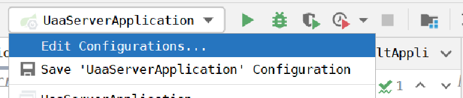
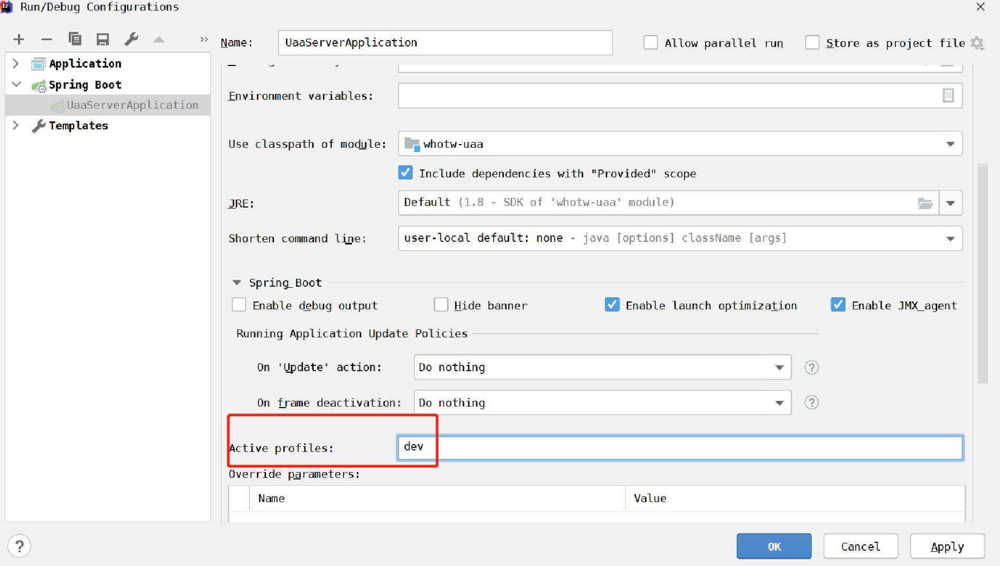

=== application.yml

```
spring:
  application:
    name: service-uaa
  profiles:
    # 获取pom中<properties>中的属性值,默认为@property-value@,pom文件中设置了取值符号为#
    active: #spring.profiles.active#
    # ================ active值设置方式  3或4方式会覆盖1或2方式 ================
    # 1、yml/properties配置文件：  spring.profiles.active=dev
    # 2、maven pom文件配置 mvn clean install -Dmaven.test.skip -Pdev & java -jar（dev表示pom文件中<profile> <id>dev</id>的id的值）
    # 3、jvm参数:  -Dspring.profiles.active=dev  idea通过edit configurations >Active Profiles进行配置或java -jar -Dspring.profiles.active=dev project.jar
    # 4、命令行:  java -jar project.jar --spring.profiles.active=uat  或mvn spring-boot:run -Dspring-boot.run.profiles=dev 命令行必须写jar后，3方式前后都可以
    # ==============================================================================
    # ================ 项目启动注意事项 ================
    # 1、通过idea启动项目时需要通过edit configurations >Active Profiles进行配置dev/uat环境或把active值默认设置为dev/uat
    # 2、通过mvn clean install -Dmaven.test.skip -Pdev and java -jar service-jar启动项目
    # 3、通过java -jar -Dspring.profiles.active=dev service-jar启动项目
    # 4、通过java -jar project.jar --spring.profiles.active=uat启动项目
    # ================================================
    # ================ 文件加载顺序 ================
    # bootstrap>application    properties>yml(官方建议项目只用一种类型的配置文件)
    # ================ 文件覆盖顺序 ================
    # application-${profile}.yml 覆盖 application.yml  ${profile} is  dev/uat/prod/etc

```

=== idea启动说明




https://docs.spring.io/spring-boot/docs/current/reference/html/spring-boot-features.html#boot-features-profiles[官方yml配置及原理解析]